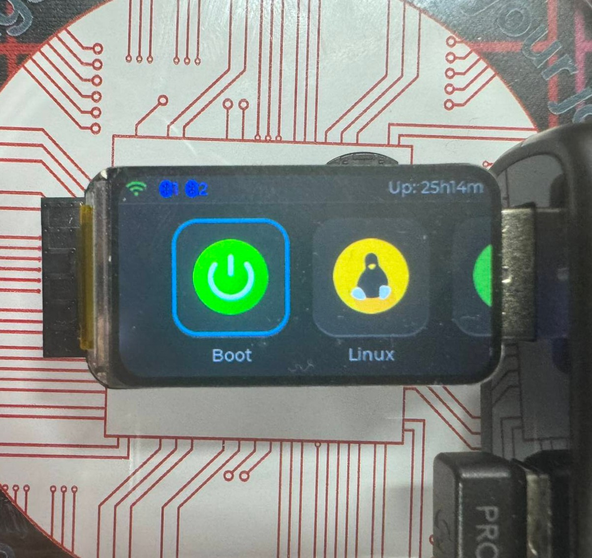
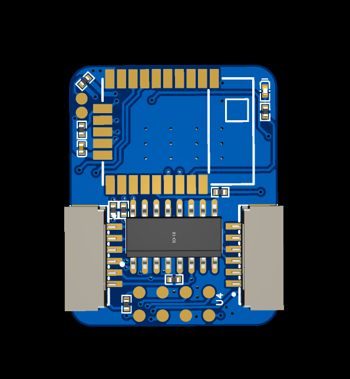
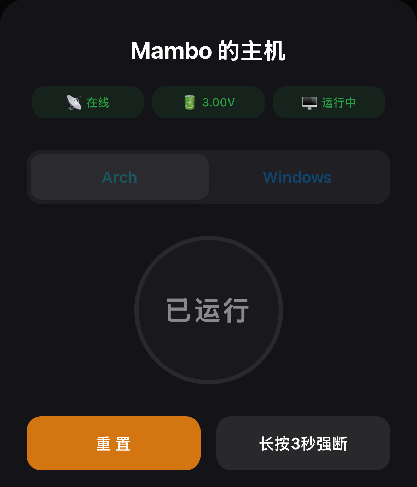

<div align="left">
  
  <a href="README.md"></a>
</div>

# GRUB-Friendly-Starting-up-System

This project is a smart start-up gateway system combining hardware and software, specifically designed for multi-OS users (especially those using the GRUB bootloader). It features an **ESP32-S3** screen-equipped gateway and an **EFR32BG22** Bluetooth Low Energy (BLE) key, providing you with an elegant, seamless, and remote-controllable PC booting and OS switching experience.

## ✨ Key Features

* **Multi-MCU Coordination**:
  * **ESP32-S3 Gateway**: Handles network communication, Mesh networking, and features an **LVGL** graphical interface for status display and interaction.
  * **EFR32BG22 BLE Module**: Acts as a BLE node/key for seamless pairing or receiving remote commands.
* **Friendly Multi-OS Support**: Offers a smarter boot entry selection solution tailored for dual/multi-OS environments with the GRUB bootloader.
* **Web Control Support**: Comes with a lightweight Node.js-based web server, allowing direct control of the boot status via a browser within the local network.
* **Fully Open Source**: Includes complete device firmware, hardware PCB manufacturing files (Gerber), and related documentation.

## 📸 Gallery

| ESP32-S3 Gateway | EFR32BG22 BLE KEy | Web UI |
| :---: | :---: | :---: |
|  |  |  |

## 📂 Repository Structure
Plaintext

```c
GRUB-Friendly-Starting-up-System/
├── Documents/           
├── Firmware/             
│   ├── ESP32_S3_Mesh/  
│   └── GRUB_Key/         
├── Hardware/             
│   ├── Gerber/           
│   └── PCB/              
├── Web/                  
│   ├── index.html        
│   ├── package.json      
│   └── server.js         
├── LICENSE               
└── README.md
```

## 🛠️ Quick Start

1. **Hardware Preparation**: Get the Gerber zip files from `Hardware/Gerber` and send them to a PCB manufacturer (e.g., JLCPCB) for fabrication and assembly.
2. **Gateway Firmware (ESP32-S3)**: Using the **ESP-IDF** environment, navigate to `Firmware/ESP32_S3_Mesh` to build and flash (`idf.py build flash monitor`).
3. **BLE Key Firmware (EFR32BG22)**: Import the `Firmware/GRUB_Key` project into **Simplicity Studio 5**, compile, and flash.
4. **Run Web Server**: Navigate to the `Web/` directory. Ensure Node.js is installed, then run `npm install` and `npm start`. Access the console in your browser.

## 📄 License

This project is licensed under the [MIT / GPL License, please modify based on your actual license]. See the [LICENSE](LICENSE) file for details.****